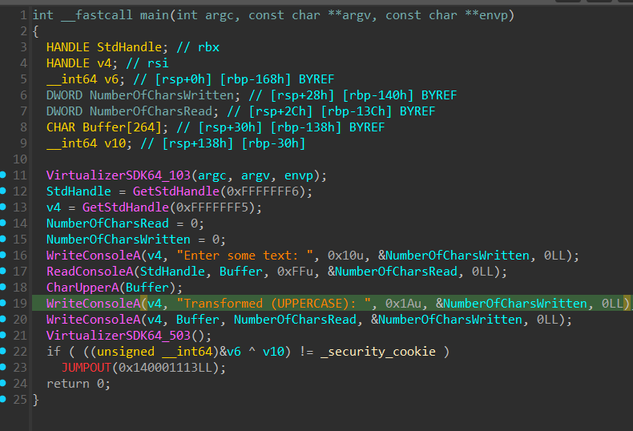

# Themida/CodeVirtualizer Devirtualizer Example

This project demonstrates the effect of devirtualizing code protected by Themida or CodeVirtualizer. Below, you can see a simple example showing the code **before virtualization** and the code **after devirtualization** side by side.

| Before Virtualization                | After Devirtualization           |
|--------------------------------------|----------------------------------|
|  |  |

After virtualization, the code is transformed into a complex, obfuscated form that is hard to analyze. The devirtualizer restores the original logic, making the code readable again.

For a detailed explanation and more examples, read the full article: [https://back.engineering/blog/09/05/2026/](https://back.engineering/blog/09/05/2026/)
